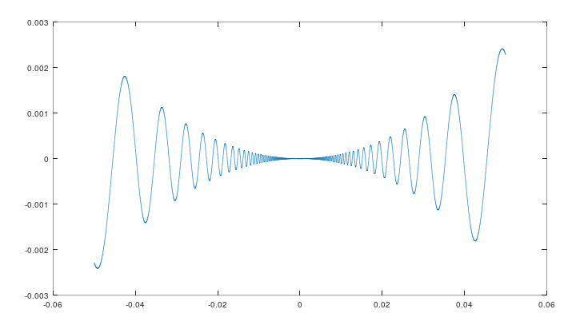
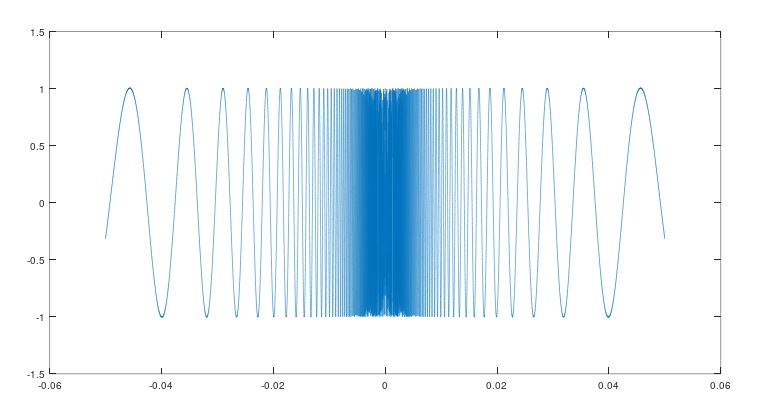

# Discontinuity of derivatives

## Table of Contents

1.  [Prologue](#org6b1a708)
2.  [Discontinuity of derivative at a single point](#org28f616f)
3.  [Baire-1 functions](#org693b0bd)
4.  [Baire-Osgood theorem](#org1922c46)

## Prologue

Derivatives appear in almost every engineering subject.
For example, Faraday's law of induction which is written as:

\begin{equation}
  \varepsilon = -N\frac{d\phi}{dt}
\end{equation}

Or the famous Newton's law:

\begin{equation}
  F = m\frac{dv}{dt}
\end{equation}

A question that I was prompted with, was that how much discontinuous derivative function can be?
Because the fundamental theorem of Calculus (Part II) tells us that:
if a function has derivatives at all point (in its domain), and the values of these derivatives are **changing continuously**, then integral cancels the effect of differentiation and gives back the original function.
But does having the equation $f(x) = \frac{dy}{dx}$ automatically implies that $f(x)$ can only be continuous? 
If not, how much discontinuous our function can be?

I've spent a good amount of time looking for this starightforward question, which doesn't get addressed in a standard Calculus course (at least in the engineering curriculums).
The answer turned out to be a bit tricky because we should first be clear that of what do we mean by "how much discontinouos".
But first, let's first start with a classic example where discontinuity of derivative occure at a *single* point.

## Discontinuity of derivative at a single point

The function below is a well-known function that has derivative at all points, and the value of these derivatives are all continuous except at a single point, $x = 0$.

\begin{equation}
f(x) = 
     \begin{cases}
       x^2 sin(1/x) &\quad\text{if } x \neq 0 \\
       0 &\quad\text{if } x = 0 \\
     \end{cases}
\end{equation}

It has the following graph:

The derivative of this function (by plugging into the definition of derivative) is:

\begin{equation}
f'(x) = 
     \begin{cases}
       x^2 sin(1/x) - cos(1/x) &\quad\text{if } x \neq 0 \\
       0 &\quad\text{if } x = 0 \\
     \end{cases}
\end{equation}

With the following graph:

Which clearly shows that it is discontinuous at \(x = 0\).
As a side note, we may ask ourselves under which conditions does the discontinuity of derivative can occure?
Is the discontinuity in above example a special type of discontinuity?
or can it be of any type, such as "jumps" discontinuity?

As it turns out, even though derivatives can be discontinuous,
they have to preserve the *Intermediate Value theorem*.

**Theorem** Suppose \(f\) is a real-valued differentiable function on \([a,b]\).
Then for every \(y\) value between \(f'(a)\) and \(f'(b)\), there exists an \(x\) in \([a,b]\) such that \(f'(x) = y\). 

What does that imply?
It simply implies that our function has to be either continuous or if there is any form of discontinuity, either **right-hand-side** or **left-hand-side**, or both limits of that point should not be defined
(as with our function at \(x = 0\))[^1].

Now *how much* discontinuous a derivative function can be?
For example, the following function:

\begin{equation}
f(x) = 
     \begin{cases}
       1 &\quad\text{if } x \quad \text{rational} \\
       0 &\quad\text{if } x \quad \text{irrational} \\
     \end{cases}
\end{equation}

Has second type discontinuity at every point \(x\) in $\mathbb{R}$.
Can this function be a derivative function?
The answer is *no*, because all derivative functions are said to be of *Baire class 1 functions* (also written as "Baire-1 function") in topology.
And there are restrictions on how much discontinuous Baire-1 functions can be.
Let's first define what Baire-1 functions are.

## Baire-0 and Baire-1 functions

Baire-0 functions are all the continuous functions.

Baire-1 is defined as follows[^2]:

**Def.** Let $D \subset \mathbb{R}$. A function $f: D \rightarrow \mathbb{R}$ is called a Baire-1 function if $f$ is pointwise limit of a sequence if continuous functions.
In other words, there is a sequence $\{f_n\}$ of functions continuous on $D$ such that for every $x \in D$, $f(x) = \lim_{n\to\infty}{f_n(x)}$.

Derivative functions are Baire-1 class functions, because from elementary Calculus we know that:

\begin{equation}
  f'(x) = \lim_{h\to0} \frac{f(x + h) - f(x)}{h}
\end{equation}

Now we have to express it in form of infinite sum. Therefore:

\begin{equation}
  f'(x) = \lim_{n\to\infty} \frac{f(x + \frac{1}{n}) - f(x)}{\frac{1}{n}}
\end{equation}

\begin{equation}
  f'(x) = \lim_{n\to\infty} n [f(x + \frac{1}{n}) - f(x)]
\end{equation}

Lastly just naming the whole expression on the right-hand-side as \(f_n(x)\), we get:

\begin{equation}
  f'(x) = \lim_{n\to\infty} {f_n(x)}
\end{equation}

and \[f_n(x)\] is continuous for n \[=\] 1, 2, 3, &#x2026; because our assumption was that \(f\) is differentiable at all points and that, implies continuity at all points as well.

Now, we only need to mention one theorem until we can answer our original question. But before that, we first have to define some terminologies.

*Topoligcal space*: This term has a rigorous definition in mathematics, but here, we are interseted is a specific example of topological space namely "metric space".
Real numbers are a form of metric space.

Next we have the following definitions:

*Closure*: a subset \[S\] of points in a topological space consists of all points in \(S\) together with all limit points of \(S\) (points that are arbitrarily close).

*Nowhere dense subset*: A subset of a topological space is called "nowhere dense" if its closure has empty interior.
For instance, the integers are nowhere dense in real numbers.

*Dense subset*:  subset \(A\) of a topological space \(X\) is dense, if every point x in X either belongs to A or is a limit point of A (points that are arbitrarily close).
For instance, the rational numbers are a dense subset of the real numbers because every real number either is a rational number or has a rational number arbitrarily close to it.

*Meagre set* or first category: is a set that is a subset of a usually larger set, and it is negligible compared to that (larger) set.
Mathematically it is defined as *a set countable union of nowhere dense sets*.

An example of a meagre set is Contor set with respect to the real numbers.
This set is constructed as below:

1.  Take the interval of [1,0] and divide it into 3 pieces.
2.  Remove the middle piece (excluding its endpoints).
3.  Leave the union of the two remaining parts ($0,\frac{1}{3}] \cup [\frac{2}{3},1]$)
4.  **Indefinitely** repeat the 2nd and 3rd step of each remaining part.
    
    Contruction of a Cantor set is visualized as below:
    
    
    
    *Non-meagre set* or second category: a set that is not meagre.
    
    **Def.** *Residual set*: The complement of a meagre set is called residual set; in other words, what is left of a (larger) set after removing the meagre sets.

## Baire-Osgood theorem

Finally, we shall mention a theorem that would answer our original question.

**Theorem** Let \(f\) be a Baire-1 function on the complete metric space \(X\). Then \(f\) is continuous on a residual subset of \(X\)[^3].

Therefore, if our function is differentiable everywhere, the derivative function should have a dense set of points where it is continouous.

And moreover:

**Theorem** Let \(f\) be a real-valued function on $\mathbb{R}$. The set of points of discontinuity of \(f\) is of first category (meagre set) if and only if \(f\) is continuous at a dense set of points.

One thing to mention in the end is that even though discontinuity points are meagre set, a derivative function can be non-integrable in the classical definition of integral i.e. Riemann integral.
An example of such a function is called *Volterra's function*.
This function is differentiable everywhere but it is discontiuous on a set of nowhere dense but positive measures (uncountably many).
Therefore, it is not Riemann integralable.

## References
John C. Oxtoby, *Measure and Category*, 2nd edition - Theorem 7.3, Page 32
Neal L. Carothers, *Real Analysis, Cambridge University* - Chapter 11, Theorem 11.20, Page 183

[^1]: This kind of discontinuity is referred to as *the second type* discontinuity compared to more well-known *first type* like "jumps" in graphs.

[^2]: This section requires familiarity with functional sequences and pointwise convergence mean. I highly recommend to watch "Functional sequences (Part 1 of 2)" by Rob Shone on YouTube; here I assume you already know what these terms mean

[^3]: This theorem is a result of "Baire category theorem" and the proof can be found on N.L. Carothers, "Real Analysis" P. 183

# Epilogue
This article is licensed under Apache License 2.0.
Please view the *LICENSE* file for more info.
If you found any grammar or technical mistakes kindly send a pull request.
