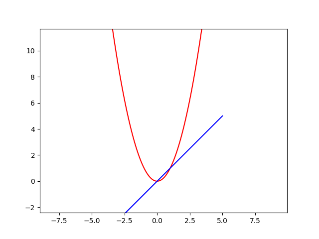
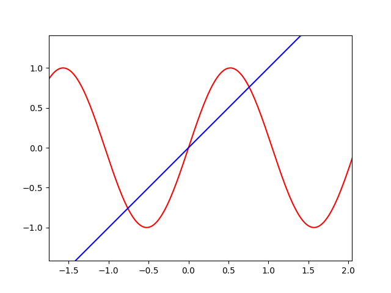
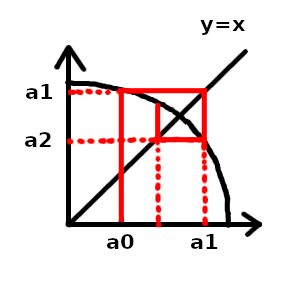
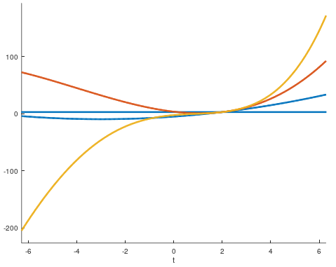

# Existence and uniqueness of differential equation solutions
Assume we have the following ordinary differential equation (ODE):

$$
y' + y = 10
$$

With the initial condition $y(0) = 3$.

Let's say, with some algebraic tricks and manipulations, we could somehow find a function $y(x)$ that could satisfy this differential equation.
For instance:

$$
y(x) = 10 + -200.85e^{-t}
$$

Could there be more functions that would satisfy this ODE as well?
Or is it the only solution? 
The **Picard–Lindelöf theorem** answers this question and guarantees the existence and uniqueness of differential equation solutions (with their initial conditions) under certain conditions.
But before stating this theorem, we need to know a few definitions and concepts first.

## Lipschitz continuity
Lipschitz continuity is a strong form of continuity which, for real numbers, is stated as below:

**Def.** A real-valued function $f : \mathbb{R} \rightarrow \mathbb{R}$ is called Lipschitz continuous if there exists a positive real constant $L$ such that:

$$
|f(x_0) - f(x_1)| \le L|x_0 - x_1|
$$

For all real $x_0$ and $x_1$.

Note that the Lipschitz continuity is stronger than the well-known uniform continuity (with its classical epsilon-delta definition).
This form of continuity talks about the existence of a *ratio* of the differences of the outputs over given inputs (not just the existence of arbitrary close outputs).
For instance, the function:

$$
f(x) = \sqrt{x}
$$

Is uniformly continuous with the epsilon-delta definition in $[0, \infty)$, but it is not Lipschitz continuous.
The proof of its uniform continuity is as follows:

Let $\epsilon > 0$. Pick $\delta = \epsilon^2$.
Since $\sqrt{x} \ge 0$ and $\sqrt{y} \ge 0$, we have:

$$
|\sqrt{x} - \sqrt{y}| \leq |\sqrt{x}| + |\sqrt{y}| = \sqrt{x} + \sqrt{y} = |\sqrt{x} + \sqrt{y} |
$$

Therefore, for $|x - y| < \delta$ we have:

$$
|\sqrt{x} - \sqrt{y}|^2 \leq |\sqrt{x} - \sqrt{y}||\sqrt{x} + \sqrt{y}| = |x - y| < \epsilon^2 \implies |\sqrt x - \sqrt y| < \epsilon
$$

But for $f(x) = \sqrt{x}$ to be Lipschitz continuous, the following limit should exist:

$$
\lim_{x \to 0} \frac{f(x)-f(0)}{x-0} = \lim_{x \to 0} \frac{\sqrt{x}}{x} = \lim_{x \to 0} \frac{1}{\sqrt{x}}
$$

Which it goes to infinity.

As another note, the definition of Lipschitz continuity might look similar to the definition of differentiability; but not all Lipschitz functions are 'everywhere differentiable'.
For instance, the function:

$$
f(x) = |x|
$$

Is a Lipschitz function but it is not differentiable at $x = 0$.

## Banach fixed-point theorem
Before stating this theorem, we first should know what a *fixed-point* and *contraction mapping* is.

### Fixed-point
The number $c$ is called a **fixed-point** of function $f$ if we have $f(c) = c$.
For instance, the function:

$$
f(x) = x^2
$$

Has *two* fixed-points; which are at $x = 0$ and $x = 1$.

Pictorially, all points where the graph of $f(x) = x$ intersects our function's graph is a fixed point.

{width=400px}

To look at another example, let's say function $f$ is:

$$
f(x) = \cos{3x}
$$

Let's plot this function alongside $f(x) = x$ to find the points where they intersect:

{width=400px}

As the graph show, this function has three fixed-points and they are depicted in the picture.

### Contraction mapping
On a complete metric space, the mapping $T: X \rightarrow X$ is called *contraction mapping* on $X$ if there exists $q$ such that:

$$
d(T(x),T(y)) \le qd(x,y)
$$

For all $x, y \in X$.

In simple terms, if we have a function that giving any two arbitrary inputs yields outputs that are closer to each other, that function is a contraction map.
For example, the function $f(x) = x^2$ we looked at previously is a contraction map between it's domain in $[0,1]$ (because any number between $0$ and $1$ become smaller when it is raised to the power $2$. Therefore, picking any two random numbers in this range we get two numbers less than the inputs, hence they are closer to each other).

Now to understand Banach fixed-point theorem, let's say we have a contraction map $f(x) = x^2$ (in the interval $[0,1]$).
If we start with an arbitrary real number, such as $x = 0.6$ and give that to our function $f$:

$$
f(0.6) = 0.36
$$

And recursively use its output as an input to our function again,

$$
f(0.6) = 0.36
$$
$$
f(0.36) = 0.1296
$$
$$
f(0.1296) \approx 0.01679
$$

Will we get closer to a specific number?
Will it diverge to infinity?
Or neither?

Let's write a simple Python program to see how it behaves for some iterations:

```
#!/usr/bin/env python3

def f(x):
    return x**2

def f_ntimes(x, n):
    for i in range(1, n):
        x = f(x)
    return x

x0 = 0.6

for i in range(2, 10):
    print(f_ntimes(x0, i))
```

Outputs:

```
0.36
0.1296
0.016796159999999997
0.0002821109907455999
7.958661109946394e-08
6.3340286662973176e-15
4.0119919145476175e-29
1.6096079122395457e-57
```

Which suggests that the output is converging to zero.
What if we started with a different initial input?
Let's run our program again, starting with $x = 2$.
Our program yields:

```
4
16
256
65536
4294967296
18446744073709551616
340282366920938463463374607431768211456
1157920892373161954235709850086879078532699846...
```

Which looks as if it is going to infinity.

Banach fixed-point theorem guarantees the convergence of a contraction mapping function in this procedure (recursively feeding output to input of a function again).
It states the following:

Let $(X, d)$ be a non-empty complete metric space with a contraction mapping $T : X \rightarrow X$.
Then T admits a unique fixed-point $x^*$ in $X$, and furthermore, $T(x^*) = x^*$.

In our previous example function, $f(x) = x^2$ was a contraction map in $[0,1]$ and this theorem implies that recursively giving outputs of this function to itself (starting from a number between $0$ and $1$) will result in reaching a fixed-point which was $0$ in this case.

To get a feeling on why does feeding output of a contraction map produces outputs closer to its fixed-point, consider the following graph:

{width=250px}

$$
f(a_0) = a_1
$$$$
f(a_1) = a_2
$$

Interpretation: If $f(x)$ is a contraction map, $|a_1 - a_2|$ will always be less than $|a_0 - a_1|$. Hence, the outputs spiral around $f(c)=c$ until they hit this point.

Now we can state the the existence and uniqueness theorem for differential equations.

## Picard–Lindelöf theorem:

Let $D \subseteq R \times R^n$ be a closed rectangle with $(t_0,y_0) \in D$.
Let $f: D \rightarrow R^n$ be a function that is *continuous* in $t$ and *Lipschitz continuous* in $y$.
Then, there exists some $\varepsilon$ such that the initial value problem

$$
y'(t) = f(t,y(t)) \text{ ,} \qquad y(t_0) = y_0
$$

has a unique solution $y(t)$ on the interval $[t_0 - \varepsilon, t_0 + \varepsilon]$

**Remark 1**:
This theorem holds only when the function on the right-hand side (i.e. $f$) is Lipschitz continuous in respect to $y$.
For instance, the following ODE:

$$
y' = \sqrt{y} \qquad y(0) = 0
$$

Is not guaranteed to have a unique solution (because it is not Lipschitz continous at $x = 0$).
In practice, to check whether $y'$ is Lipschitz continuous or not, we first calculate the derivative of $y'$ in respect to $y$ and check whether this derivative function is continuous[^3].

[^3]: It can be easily shown that all continuously differentiable functions are Lipschitz continuous.
Note that the opposite is not necessarily true.
For instance:
$$
\begin{cases}
  x^2sin{\frac{1}{x}} & \text{if } x \neq 0 \\
  0 & \text{if } $x=0$
\end{cases}
$$

For this example:

$$
\frac{dy'}{dy} = \frac{d}{dy}\sqrt{y} = \frac{1}{2\sqrt{y}}
$$

Which is undefined for $y = 0$, hence it is not Lipschitz continuous.

**Remark 2**:
This theorem only guarantees the existence and uniqueness of solutions on the closed local neighborhood $[t_0 - \varepsilon, t_0 + \varepsilon]$.
However, It can be shown by the *Grönwall's inequality* lemma that this local solution is in fact, a global solution to a differential equation (with a given set of initial conditions).

Now we proceed to prove the Picard-Lindelöf theorem.

### Proof sketch
Recall that an ODE with its initial condition has the form:

$$
y'(t) = f(t,y(t)) \text{ ,} \qquad y(t_0) = y_0
$$

From elementary Calculus we know that function $y(t)$ satisfies this initial value problem (IVP) on the open interval $I$ (containing $x = t_0$), if and only if it satisfy the following integral equation:

$$
y(t) - y(t_0) = \int_{t_0}^{t} f(s,y(s))ds
$$

Next, we construct a sequence of functions that would approximate the function $y(t)$ better and better with each term.
This series is called *Picard's sequence* and the terms are constructed as below:

The initial term is:

$$
\phi_0(t) = y_0
$$

And the next terms are computed as:

$$
\phi_{k+1} = y_0 + \int_{t_0}^{t}f(s,\phi_k(s))ds
$$

Equivalently, with a different notation we can define the following function $T$ that takes a *function* and outputs another *function* for a given $\phi(t)$:

$$
T(\phi)(t) = y_0 + \int_{t_0}^{t}f(s,\phi(s))ds
$$

Now it can be proved (by Banach fixed-point theorem) that the function $T$ is a contraction map (in other words, it produces functions which their maximum value is closer to each other than the original functions) and therefore has a unique fixed-point which is the unique solution to our ODE:

$$
T(\phi) = \phi
$$

Why is $\phi$ a solution to our differential equation?
Recall the definition of $T$:

$$
T(\phi)(t) = y_0 + \int_{t_0}^{t}f(s,\phi(s))ds
$$

Therefore, $\phi$ is a function that satisfy our differential equation (by differentiating both sides):

$$
y'(t) = f(t,y(t))
$$

For a given set of initial conditions.

### Detailed proof
Assume we have the following closed intervals:

$$\overline{B_b(y_0)} = [y_0 - b, y_0 + b]$$
$$\overline{I_a(t_0)} = [t_0 - a, t_0 + a]$$

And the function *T* we defined previously:

$$
T(\phi)(t) = y_0 + \int_{t_0}^{t}f(s,\phi(s))ds
$$

Maps a set of continuous functions from $I_a(t_0)$ to $B_b(y_0)$ to other functions that map $I_a(t_0)$ to $B_b(y_0)$.
Mathematically[^1]:

[^1]: Note that the expression $C(A,B)$ means:
$$
C(A,B) = \{f: A \rightarrow B \text{ | f is continuous}\}
$$

$$T: C(I_a(t_0),B_b(y_0)) \rightarrow C(I_a(t_0),B_b(y_0)) $$

The proof consists of *two parts*.

1. We must show that function $T$, "maps a $C(I_a(t_0),B_b(y_0))$ into itself":
What it means is that, we want to show that giving function $\phi(t)$ to $T$ (with values in $[y_0 - b, y_0 + b]$), results in a function which is also defined in this interval as well.
In other words, by having:

$$
\sup_{t \in [t_0-a,t_0+a]} |\phi(t) - y_0| \le b
$$

We should get:

$$
\sup_{t \in [t_0-a,t_0+a]} (T(\phi)(t) - y_0) \le b
$$

To check this, we calculate the distance between $T(\phi)(t)$ and the center point $y_0$, and see if it the result of $T$'s output is still less than $b$ (in order to lie in the neighborhood centered around $y_0$):

$$
\sup_{t} | T(\phi)(t) - y_0 |
$$$$
= \sup_{t} | y_0 + \int_{t_0}^{t}f(s,\phi(s))ds - y_0 |
$$$$
= \sup_{t} | \int_{t_0}^{t}f(s,\phi(s))ds |
$$$$
\le \int_{t_0}^{t} \sup_{t}f(s,\phi(s))ds
$$$$
\le \int_{t_0}^{t} Mds
= M|t'-t_0|
\le Ma
$$

What is $a$? It is a constant that depends only on our integral range ($t_0$ to $t$) which we can choose.
Hence, we want to have the following condition:

$$
Ma < b
$$

Therefore, we choose the integral range such that, $a < \frac{b}{M}$.

2. We need to prove $T(\phi)(t)$ is a contraction map.
The proof is as follows:

$$
\sup_{t \in [t_0-a,t_0+a]}|T(\phi)(t) - T(\gamma)(t)|
$$$$
= \sup_{t \in [t_0-a,t_0+a]}|y_0 + \int_{t_0}^{t}f(s,\phi(s))ds - y_0 - \int_{t_0}^{t}f(s,\gamma(s))ds|
$$$$
= \sup_{t \in [t_0-a,t_0+a]}|\int_{t_0}^{t}(f(s,\phi(s)) - f(s,\gamma(s)))ds| \qquad (1)
$$$$
\le \sup_{t \in [t_0-a,t_0+a]}\int_{t_0}^{t}|(f(s,\phi(s)) - f(s,\gamma(s)))|ds \qquad (2)
$$$$
\le L\sup_{t \in [t_0-a,t_0+a]}\int_{t_0}^{t}|(\phi(s) - \gamma(s))|ds
$$$$
\le La\sup_{t \in [t_0-a,t_0+a]}|(\phi(s) - \gamma(s))
$$

(1) From the property of integrals under $\sup$.

(2) Since F is Lipschitz continuous

Hence, the last expression is a contraction if we choose $a$ such that:

$$
a < \frac{1}{L}
$$

Now we can apply Banach fixed-point theorem to $T$ which we get:

$$
T(\phi) = \phi
$$

q.e.d

**Note:** We have to control $a$'s value for both 1st step and 2nd step.
For the 1st step:

$$
a < \frac{b}{M}
$$

And for the 2nd step:

$$
a < \frac{1}{L}
$$

Hence, the proper $a$ should be:

$$
a < \min\{\frac{b}{M}, \frac{1}{L}\}
$$

As a tangible example for a contraction map $T$, let's run through an example.

$$
y' = 1 + y^2 \qquad y(2) = 3
$$

Let's say we have two arbitrary functions $\phi_0(t)$ and $\phi_1(t)$ defines as:

$$
\phi_0(t) = t^2
$$

$$
\phi_1(t) = t^2 + 3t^3
$$

We want to show that the maximum output of:

$$T(\phi_0)(t)$$

And:

$$T(\phi_1)(t)$$

Around $[2-a, 2+a]$, are less than the original $\phi_0(t)$ and $\phi_1(t)$ in this interval.
Let's calculate the transformations:

$$
\sup_{t \in [2-a,2+a]}|T(t^2)(t) - T(t^2+3t^3)(t)|
$$$$
= \sup_{t \in [2-a,2+a]}|3 + \int_2^t 1 + (s^2)^2ds - 3 - \int_2^t 1 + (s^2 + 3s^3)^2ds|
$$$$
= \sup_{t \in [2-a,2+a]}|\int_2^t 1 + (s^2)^2ds - \int_2^t 1 + (s^2 + 3s^3)^2ds|
$$$$
\le \sup_{t \in [2-a,2+a]}\int_2^t|(1 + (s^2)^2) - (1 + (s^2 + 3s^3)^2|ds
$$

Now before continuing, $f(x) = 1 + x^2$ is Lipschitz continuous for inputs such as $x=1, 2, 3, ...$ in an interval $[a,b]$.
But what does it mean when $x$ is not a number, but output of another function itself? (like in our case):

$$
|(1 + (t^2)^2) - (1 + (t^2 + 3t^3)^2| \le L (t^2) - (t^2 + 3t^3)|
$$

Is it also Lipschitz continuous? Yes, since for a given $t$ we have something like:

$$
|(1 + (100)^2 - (1 + (300)^2| \le L (100) - (300)|
$$

Which is fine with the definition of a Lipschitz function (... there is a constant $L$ such that for **every** $x,y$ in $X$, we have ...).
To test this out, say $t \in [1.5, 2.5]$. Then for $t=1.5$ we have:

$$
14.6 \le L
$$

And for $t=2.5$:

$$
59.3 \le L
$$

$L=59.3$ in case of the function $f(y) = 1 + y^2$, is the smallest constant where we have the Lipschitz continuity in the interval of $[1.5, 2.5]$.

Therefore, by choosing $a < \frac{1}{59.3} = 0.016$ we get the contraction on this neighborhood.

To verify:

$$
\sup_{t \in [1.984,2.016]}\int_2^t804.00ds
$$$$
\le 59.3\sup_{t \in [1.984,2.016]}\int_{2}^{t}24.58ds
$$$$
\implies 12.864 \le 59.3*0.16*24.58 = 23.321
$$

Now that we've seen how $T$ is a contraction map, let's visually see its behavior under some Picard iterations for a differential equation.
Assume we have the following ODE:

$$
y(x)' = x + y \qquad y(2) = 3
$$

Let's find the few terms:

$$\phi_0(t) = 3$$
$$\phi_1(t) = 3 + \int_2^t (s + 3)ds = \frac{t^2+6t}{2} - 5$$
$$\phi_2(t) = 3 + \int_2^t (s + \frac{s^2+6s}{2} - 5)ds = \frac{t^3 + 12t^2 - 30t}{6} + \frac{11}{3}$$
$$\phi_3(t) = 3 + \int_2^t (s + \frac{s^3 + 12s^2 - 30s}{6} = \frac{t^4 + 16t^3 - 48t^2 + 88t}{24} - \frac{7}{3}$$

We now shall see $\sup_t|(\phi_1(t) - \phi_3(t))| \le q\sup_t|(\phi_0(t) - \phi_2(t))$ for some $0 < q < 1$ on the graph:

{width=300px}

# Epilogue
This article was intended to be written as mathematically accurate as possible.
If you found any grammar or technical mistakes kindly send a pull request.
This article is licensed under Apache License 2.0.
Please view the *LICENSE* file for more info.
