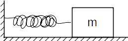

# Existence and uniqueness of second-order linear DE solutions
Many real-world physical phenomena express themselves in terms of second-order linear differential equations.
For instance, the friction-less mass-spring problem:

{width=250px}

Has the following equation for its location on the x-axis (using the Newton's law of motion):

$$
x'' + x = 0
$$

Which from elementary differential equations textbooks, we know that its solution has the general form of:

$$
x(t) = c_0\cos{t} + c_1\sin{t}
$$

(The value of constants $c_0$ and $c_1$ are determined by the initial conditions of this system i.e. the initial position and the velocity of the mass in this problem).

Now we may ask, is the existence and uniqueness theorem for first-order IVPs that we discussed in the previous article still applicable in this linear second-order IVPs?
Since this IVP has **two** solutions, and both, as well as each of them satisfy the equation, is the superposition of these two independent solutions really the "general" solution to this ODE?
The answer is yes.

## Picard-Lindelöf theorem for second-order linear IVPs
Assume we have the following second-order linear equation:

$$
\frac{d^2y}{dx^2} + P(x)\frac{dy}{dx} + Q(x)y = R(x)
$$

With initial conditions:
$$
y(x_0) = y_0
$$$$
y'(x_0) = y'_0
$$

We can introduce new variable $z = \frac{dy}{dx}$ to turn that second-order ODE into the following *system of first-order equations*:

$$
\frac{dy}{dx} = z \qquad y(x_0) = y_0,
$$$$
\frac{dz}{dx} = -P(x)z -Q(x)y + R(x) \qquad z(x_0) = y'_0
$$

Since the right-hand-side of both equations consist of continuous functions (i.e. $P(x)$, $Q(x)$, ...), there is a constant $K$ such that for all $x \in [a,b]$, they yield values less than or equal $K$.
Therefore, we have the Lipschitz condition:

$$
|f(x,y_0,z_0) - f(x,y_1,z_1)| \leq K(|y_0 - y_1| + |z_0 - z_1|)
$$

For both right-hand-sides.

At this point, we can construct Picard iterations for each of the equations independently.
Therefore, this system of first-order equations has a unique solution for $x$ in the interval $[a, b]$.

**Ex.** Solve the following IVP using Picard iteration:

$$
y'' + y = 0 , \qquad y(0) = 1 \qquad y'(0) = 0
$$

**Solution:**
We first write the IVP in the following first-order form:

$$
\frac{dy}{dx} = z, \qquad y(0) = 1,
$$$$
\frac{dz}{dx} = -y, \qquad z(0) = 0
$$

Now, we construct Picard iterations for each term as follows:

$$
y_0(x) = 1
$$$$
z_0(x) = 0
$$\rule{2in}{0.2pt}$$
$$$$
y_1(x) = 1 + \int_{x_0}^{x} 0 dt = 1
$$$$
z_1(x) = 0 + \int_{x_0}^{x} 1 dt = x
$$\rule{1in}{0.2pt}$$
$$$$
y_2(x) = 1 + \int_{x_0}^{x} -t dt = 1 - \frac{x^2}{2}
$$$$
z_2(x) = 0 + \int_{x_0}^{x} 1 dt = x
$$\rule{1in}{0.2pt}$$
$$$$
y_3(x) = 1 + \int_{x_0}^{x} -t dt = 1 - \frac{x^2}{2}
$$$$
z_3(x) = 0 + \int_{x_0}^{x} 1 - \frac{t^2}{2} dt = x - \frac{x^3}{3!}
$$\rule{1in}{0.2pt}$$
$$$$
y_4(x) = 1 + \int_{x_0}^{x} -t + \frac{t^3}{3!} dt = 1 - \frac{x^2}{2!} + \frac{x^4}{4!}
$$$$
z_4(x) = 0 + \int_{x_0}^{x} 1 - \frac{t^2}{2} dt = x - \frac{x^3}{3!}
$$\rule{1in}{0.2pt}$$
$$$$
...
$$

Using mathematical induction, it can be easily be shown that $y_n(x)$ and $z_n(x)$ are Taylor series of $\sin{x}$ and $\cos{x}$ functions!
That is:

$$
\sin{x} = x - \frac{x^3}{3!} + \frac{x^5}{5!} - \frac{x^7}{7!} + ...
$$
$$
\cos{x} = x - \frac{x^2}{2!} + \frac{x^4}{4!} - \frac{x^6}{6!} + ...
$$

Therefore, the general solution to the second-order equation has the form of:

$$
y(x) = c_0\cos{x} + c_1\sin{x}
$$

# References
George F. Simmons, *Differential Equations With Applications And Historical Notes* - Page 640

Earl A. Coddington, *An Introduction to Ordinary Differential Equations* - Page 246

# Epilogue
This article was intended to be written as mathematically accurate as possible.
If you found any grammar or technical mistakes kindly send a pull request.
This article is licensed under Apache License 2.0.
Please view the *LICENSE* file for more info.
